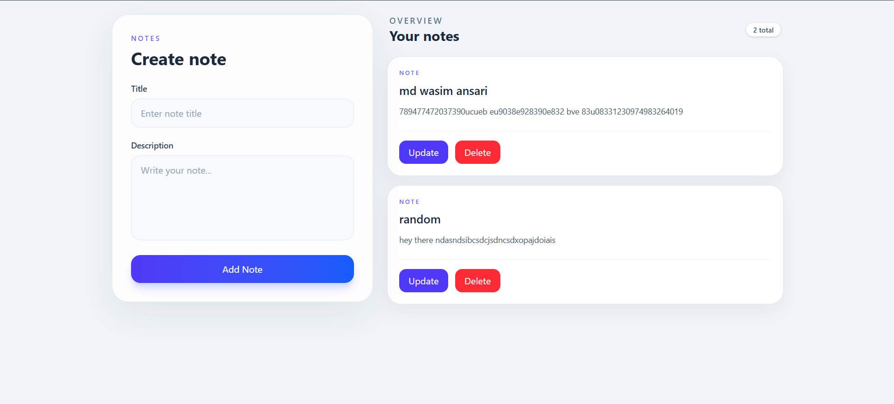

# 📝 Notes CRUD Application

A full-stack Notes Management application where users can create, view, update, and delete notes.

This project was built to understand how a frontend application communicates with a backend API and how data is stored and managed in MongoDB.

---

## 📸 Screenshots

The dashboard allows users to create new notes and manage their existing notes from a single interface.

## 🚀 Features

- ➕ Create a new note
- 📋 Display all notes
- ✏️ Update existing notes
- 🗑️ Delete notes
- 🔄 Real-time UI updates after CRUD operations
- 🌐 Frontend and backend API integration
- 💾 MongoDB database integration
- 🔐 Backend REST APIs
- ⚡ Responsive UI
- 🎨 Styled using Tailwind CSS
- 🌍 CORS configured for frontend-backend communication

---

## 🖥️ Application Preview

The application contains two main sections:

### Create Note

Users can enter:

- Note title
- Note description

and submit the form using the **Add Note** button.

### Your Notes

All created notes are displayed with:

- Note title
- Note description
- Update button
- Delete button

---

## 🛠️ Tech Stack

### Frontend

- React.js
- JavaScript
- Tailwind CSS
- Fetch API / Axios
- React Hooks

### Backend

- Node.js
- Express.js
- MongoDB
- Mongoose
- REST API
- CORS

